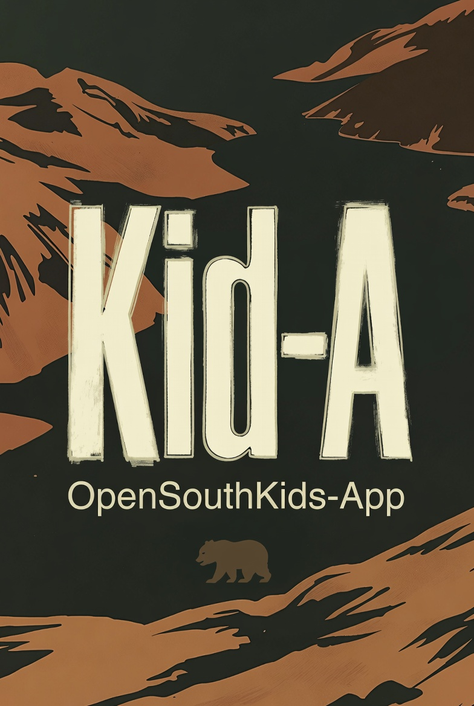

# kid-a



Web app to manage the pear-ish OpenSouthKids.

Aplicación web para gestionar OpenSouthKids con cariño pear-ish.

## Product stories

- [Kid happy path](docs/kid-story.md)

## Local development

This frontend uses React, TypeScript, Vite, and React Router.

```bash
npm install
npm run dev
```

Useful checks:

```bash
npm run lint
npm run build
npm run preview
```

## Deployment

The default `npm run build` and `npm run build:gh-pages` commands build the
static sample-data app for GitHub Pages project hosting with the Vite base path
`/kid-a/`. The `Frontend CI` GitHub Actions workflow installs dependencies,
runs linting, builds the app, uploads the Pages artifact, and deploys from
`main`.

### Alternate Node/Netlify deployment

The static GitHub Pages deployment remains unchanged. For stateful local
development, install the Netlify CLI and run Netlify Dev so functions and
Netlify Database use the same runtime model as deploys:

```bash
netlify dev
```

`build:netlify` builds the frontend with `VITE_DATA_LAYER=remote`,
`VITE_BASE_PATH=/`, and `VITE_API_BASE_URL=/api`, so the same React app uses
function endpoints instead of bundled mutable sample data.

`netlify.toml` also routes those endpoints to `netlify/functions/api.ts`.
Netlify Functions use Netlify DB/Postgres for writable state and staff
magic-link token hashes. On startup, the function applies DB migrations and
seeds an empty DB from committed JSON in `src/data`. To force a non-production
reset later, run:

```bash
NETLIFY_DB_URL=... npm run data:reset-db
```

Set `ADMIN_PASSWORD` to enable the `/admin` page to generate 1-day desk, wheel,
or activity-specific lead links by default; the duration in days can be changed
when generating a link. The `build:gh-pages` static deployment still uses
bundled sample data and does not call the remote endpoints; it exposes built-in
demo links for the same roles. See [`docs/storage-json.md`](docs/storage-json.md)
for the DB storage layout.

Set `KID_A_ADMIN_TOKEN` to enable protected admin backup and restore endpoints.
The export includes `exportedAt`, `passports`, `wheelPrizes`, and `prizesWon`.

```bash
curl -H "Authorization: Bearer $KID_A_ADMIN_TOKEN" \
  https://example.netlify.app/api/admin/export > kid-a-backup.json

curl -X POST -H "Authorization: Bearer $KID_A_ADMIN_TOKEN" \
  -H "Content-Type: application/json" \
  --data-binary @kid-a-backup.json \
  https://example.netlify.app/api/admin/import
```
